# OpenSkiTime

[](https://github.com/tnakeli/OpenSkiTime/actions/workflows/ci.yml?query=branch%3Amaster)
[](LICENSE)
[](https://dotnet.microsoft.com/download/dotnet/10.0)

OpenSkiTime is a desktop race-office application for alpine skiing. It brings registration, start lists, timing and result preparation into one compact workspace. Built with .NET 10 and Avalonia, it runs locally on Windows and keeps each event series in a portable `.ost` file. Local race operation works offline; FIS lookups and online publishing are optional.

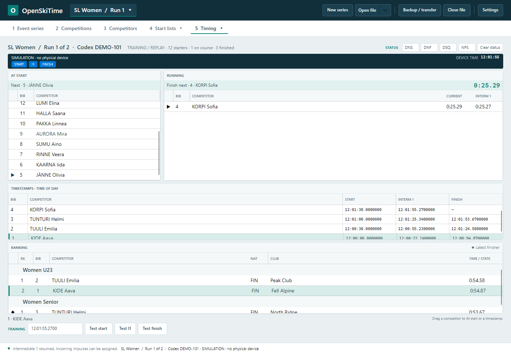

*All screenshots show fictional athletes, generated points data and simulated timing. They do not show a real race or an official FIS list.*

## Race-office workflow

1. **Event series:** create or open a series file, set its dates and organizer, and make a backup or transfer copy. The Open file menu also lists recent series. Optionally import a reviewed event and its competitions from the FIS calendar.
2. **Competitions:** set race names, dates, disciplines, runs, course details and technical delegates. Filter and sort the competition grid. Course details can be shared with all races of the same discipline and TD information with all races in the series.
3. **Competitors:** edit a dense, keyboard-friendly grid, paste rows from Excel, assign participation per competition, review highlighted changes and save them together. Save and apply category rules. An optional alpine FIS points-list download supports searching and updating athletes by code; the list can then be used offline.
4. **Start lists:** choose a competition and run, draw the first-run bib order, then export TSV or open a printable view. Prepare Run 2 from classified Run 1 results, with first-run times visible alongside its starters.
5. **Timing:** use **At start**, **Running**, **Timestamps** and **Ranking** to follow the race. Reorder starters, assign impulses, see elapsed times and splits, and classify competitors. Original device input and correction history remain in the event file.
6. **Results:** prepare jury, course, forerunner and weather information; review calculated race points and the FIS penalty; then record TD approval and export the approved XML. Optional FIS submission is currently limited to test mode.
7. **Timing report:** review automatically populated A timing, collect optional B and hand-clock evidence, read receipt images or a timing device in one review dialog, and prepare the alpine timing report XML. Equipment and timekeeper defaults are reusable; FIS submission remains test-only.

### 1 · Event series

One portable file holds the series, competitions, raw timing input, corrections and approved result revisions. Backups and transfer copies carry this history with them.

**Browse FIS calendar** previews an event's races before filling the series and competitions. Column-header menus filter and sort events by dates, location, nation, event name and race count. Save a public FIS API key in Settings to use this optional online feature; missing details remain editable.

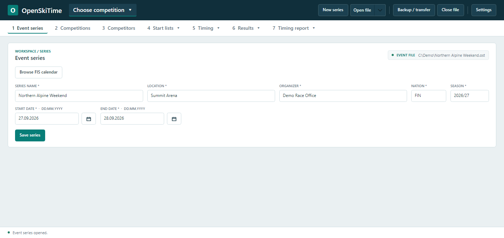

### 2 · Competitions

Select a race to edit its identity, schedule, FIS category, course and technical delegate. **Use FIS rules** distinguishes FIS races from local competitions. Optional **Get competition data** and **Browse FIS homologations** help fill race and course details.

**Save Course & Homologation to all Giant Slalom races** (named after the edited race's discipline) shares course details with the series' other races of that discipline. **Save TD to all races** shares TD information with every race in the series. Both apply in one save. Per-run course overrides in Results remain independent.

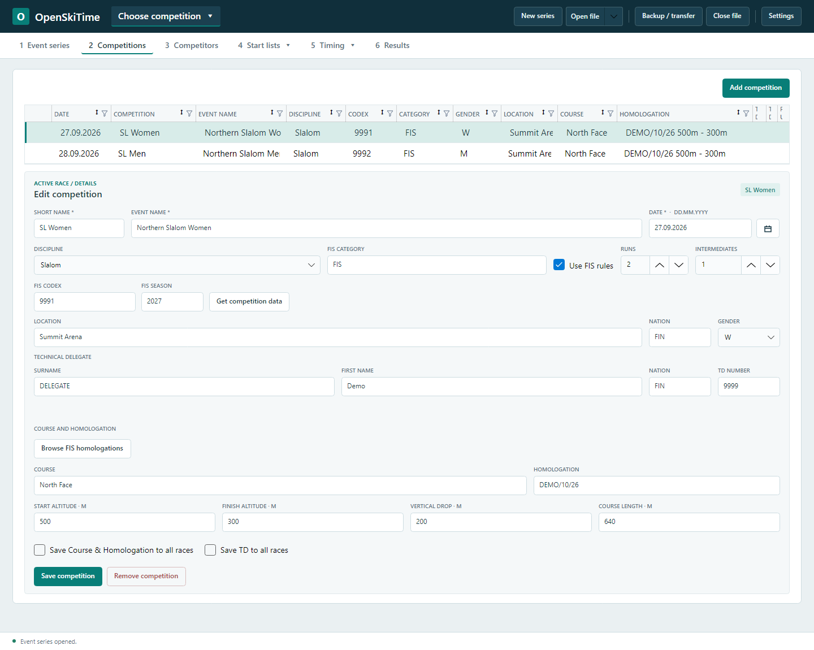

### 3 · Competitors

The registration grid keeps participation, identity, category and FIS points visible together. Column filters help find athletes quickly, while reviewed edits can be saved together.

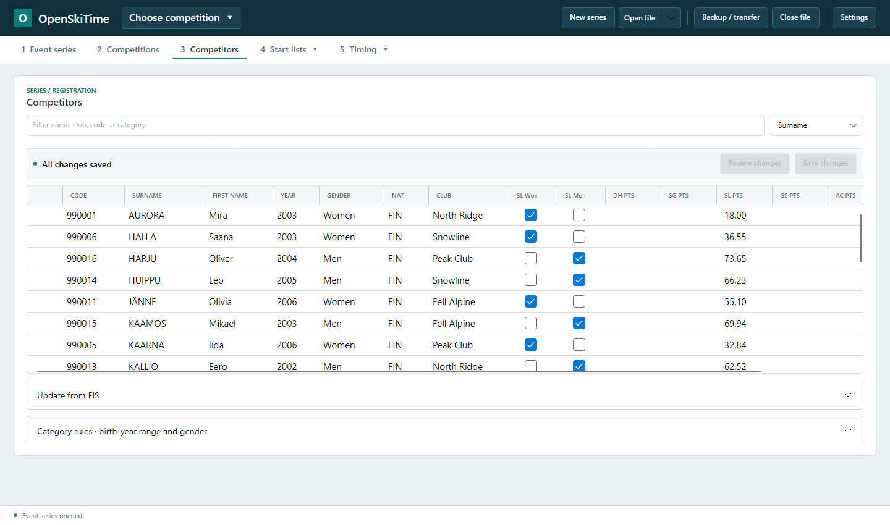

### 4 · Start lists

The competition/run selector opens the active start list directly. Run 2 can be prepared while timing capture stays connected.

The [draw fairness and verification guide](docs/fis-draw-fairness.md) explains points groups, the double draw, saved random seeds and replay verification. A runnable example compares the production draw with an independent implementation using synthetic entrants.

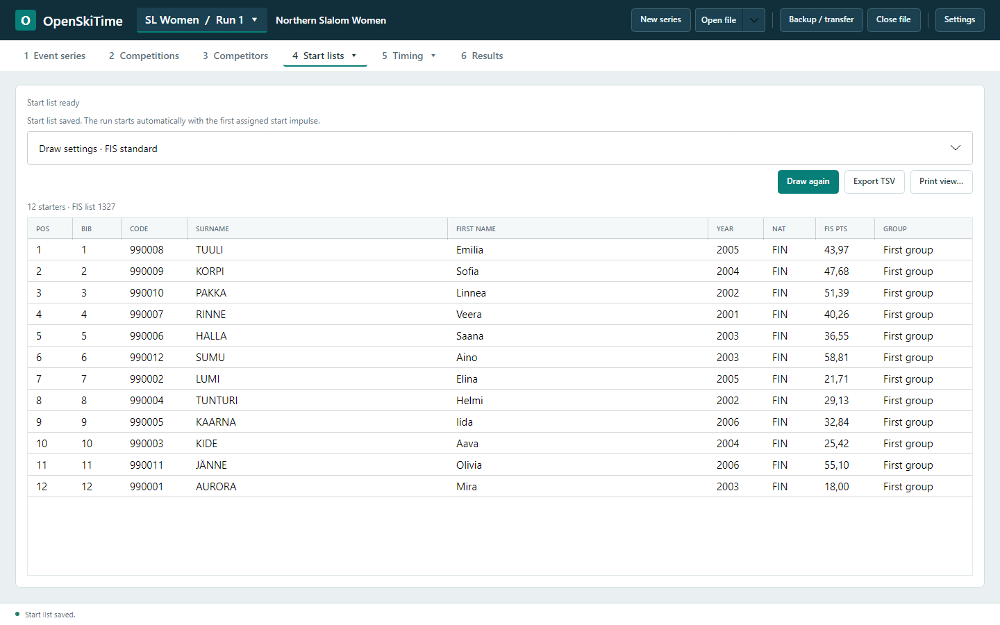

### 5 · Timing and classification

At start and Running show the immediate race state; Timestamps and Ranking retain the full picture. Channel HOLD controls retain incoming impulses for review. Ranking columns support filtering and sorting, and keyboard shortcuts and context actions speed up race control.

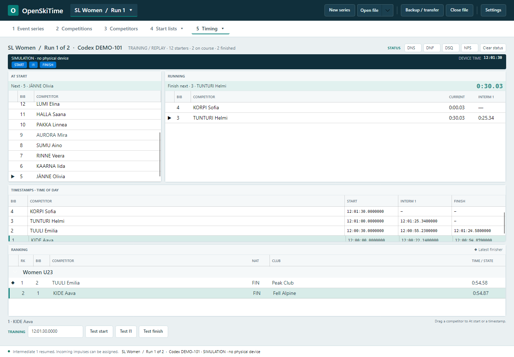

**Edit classification** records DNS, DNF, DSQ or NPS, including after the run or after disconnecting capture. DSQ entries can include a gate, reason or ICR reference, and reporting judge. Corrections record the operator and reason; clearing or undoing a classification adds history and restores the underlying time. Raw input is preserved.

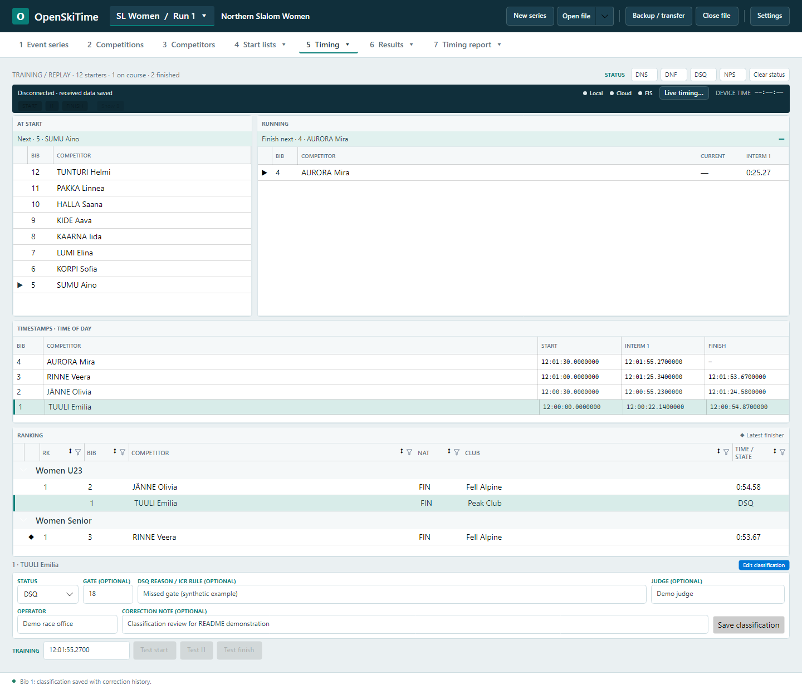

See [timing setup and operation](docs/timing.md) and [post-run classification](docs/post-run-classification.md) for details.

### 6 · Race information, penalty and XML

Prepare race information before timing begins, or complete it afterwards. Jury members and each run's course setter, course, gates, forerunners, start time, conditions and temperatures are editable. Valid changes save automatically; invalid entries remain visible with a **Not saved** message. An optional weather browser offers race-day forecasts alongside manually entered measured temperatures.

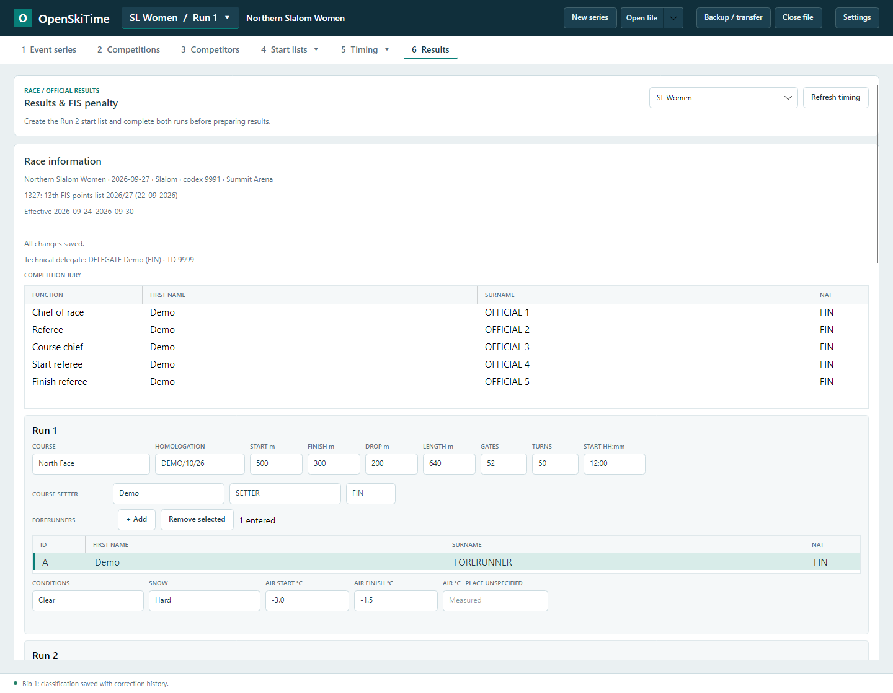

After the required runs are complete, Results assembles classified times and race points and calculates the FIS penalty using the saved starter points and matching points-list rule tables. Review the finishers, best starters and calculation with the TD. **TD approves · create XML** stores the exact XML and race-information snapshot as an immutable revision in the event file; **Export approved XML** writes that saved revision.

**Send XML · test mode** can validate the approved file through the FIS Member API using the single FIS API key saved in Settings. It does not publish official results. See [race information and XML operation](docs/results-race-information.md) and [FIS penalty calculation](docs/fis-penalty-review.md).

### 7 · Timing report

Review A timestamps and the first, last and fastest samples for each run. An optional B Clock, configured by role in Settings, supplies backup observations without changing race results; a B Clock status shows whether it is behaving as expected. **Show B** in Timing displays the backup comparison for 30 seconds; missing signals and excessive differences remain visible as warnings.

Results and Timing report follow the competition selected in the shared header; the run remains available when returning to Timing. The report reads that competition's committed timing data automatically and saves edits in the background. Open the B, hand-start or hand-finish dialog to choose, drop or paste receipt images, or to read a Timy, MT1, ALGE Results or replay-file device directly; nothing is saved until you press OK. The Times tab groups synchronization and run timestamps. Local OCR displays detected timestamps in a dialog; OK applies the checked matches. Images and recognition text remain in dialog memory only. Accepted times and report history stay in the event file. Create and export an approved XML revision or submit it to FIS in test mode. Create local PDFs through PDF Factory. See [timing report operation](docs/timing-report.md) and [Settings](docs/settings.md).

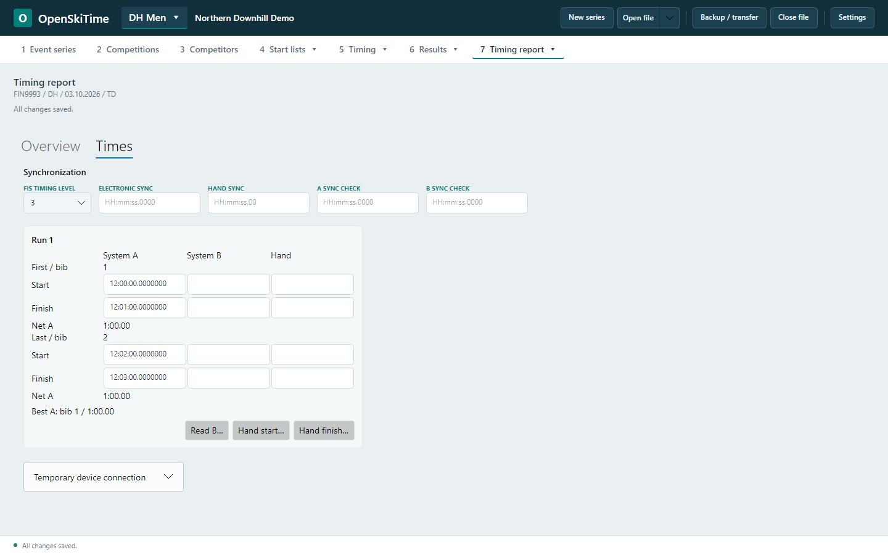

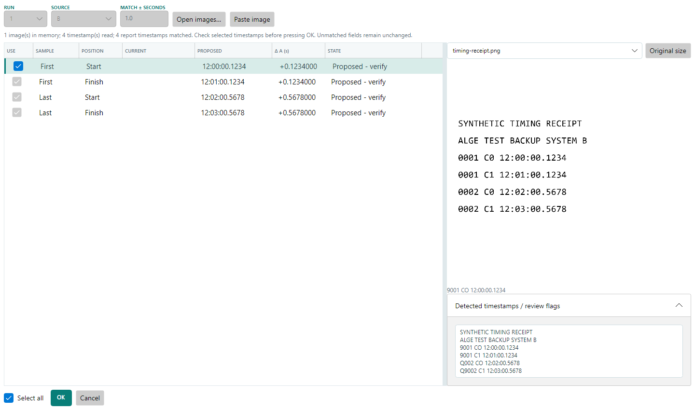

### 8 · PDF Factory

Generate entry lists, saved start lists, referee forms, penalty calculations, approved official results and timing reports from one view. Each row shows its filename and Generated, Outdated or Not generated status. **Generate All** skips unavailable reports and continues after individual failures. **Open** launches the generated file directly from the event folder. Optional A4 PDF backgrounds and margins are saved with the series; **Preview** shows the margin boundaries before saving. See [PDF Factory operation](docs/pdf-factory.md).

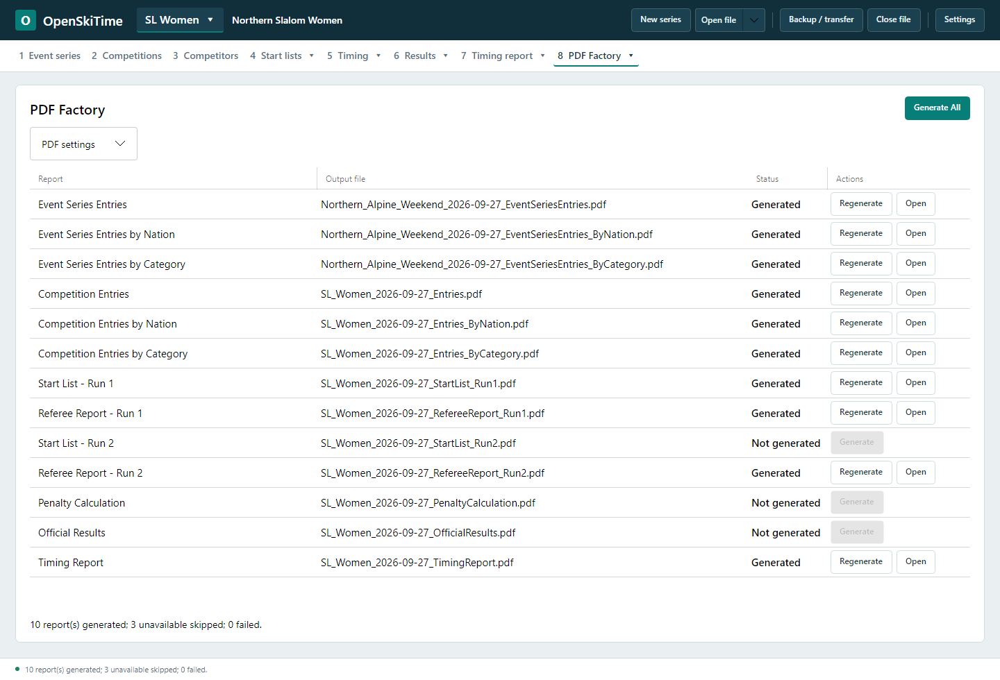

Referee forms use their own FIS layout, fixed margins and no organizer background. The default form fits one A4 page. DSQ, DNS, NPS and DNF tables grow with the saved classifications and continue across pages when needed.

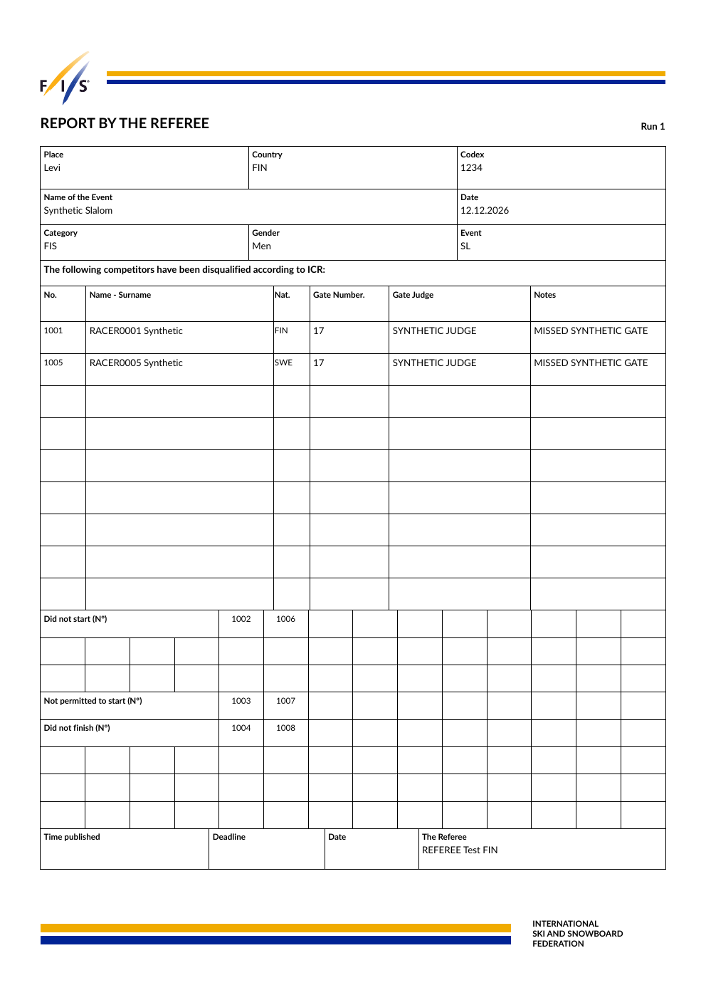

## Timing sources and live publishing

OpenSkiTime has adapters for ALGE Timy 2/3 native USB, MT1 USB/serial and the ALGE Results service. A simulator and ASCII replay are available for practice. Device connection and configuration live in Settings; timing capture continues independently of optional online work.

**Live timing** offers FIS TCP/HTTPS for FIS races and a standalone browser view for every race. Local publishing works offline; Cloud publishing uses the same server and can run alongside FIS. A Cloud server accepts new races only from publishers holding a key issued by its operator; save it in Settings → Live timing. You can run your own server, or contact the [maintainer](#maintainer) for a key to use the hosted `live.openskiti.me`. The server's front page lists every race it is publishing. The timing view shows all three statuses and provides Start, Stop, Refresh and session deletion controls. See [live timing setup and operation](docs/live-timing.md) and [cloud server deployment](docs/live-timing-cloud-deployment.md).

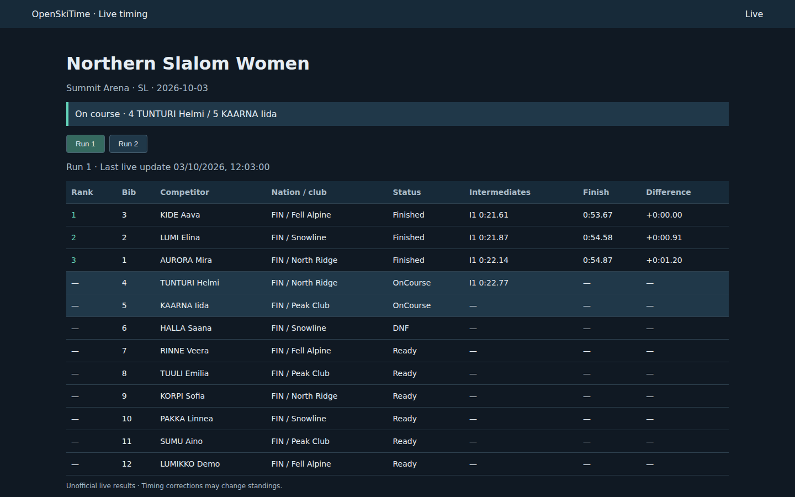

Settings → About shows the software version (Semantic Versioning) and the implemented FIS rule season (2026-27), with links to the license, issue reporting, [security policy](SECURITY.md) and privacy statement.

## Current scope

OpenSkiTime is in pre-release development. The current draw profile covers standard FIS two-run SL/GS and single-run DH/SG. Local category draws, special Cup, youth, snow-seed and three-run formats are not yet supported. Automatic backup-time substitution and production FIS result submission are pending. Generated XML acceptance by FIS and physical-device race operation still require verification, including a complete rehearsal with independent backup timing.

New series files use the current development format. Incompatible older development files are rejected without modification; automatic schema upgrades are not available. Create a new series for the current version and retain older files and backups.

## Run from source

Install the [.NET 10 SDK](https://dotnet.microsoft.com/download/dotnet/10.0) on Windows. From the repository root:

```powershell
dotnet restore OpenSkiTime.slnx
dotnet build OpenSkiTime.slnx -c Release
dotnet run --project src/OpenSkiTime.Desktop -c Release
```

Run the automated tests with `dotnet test OpenSkiTime.slnx -c Release`.

## Maintainer

OpenSkiTime is developed and maintained by **Teemu Niemi** (GitHub [@tnakeli](https://github.com/tnakeli), <tniemi@gmail.com>). Use [GitHub issues](https://github.com/tnakeli/OpenSkiTime/issues) for bugs and feature requests, and the [security policy](SECURITY.md) for vulnerabilities.
