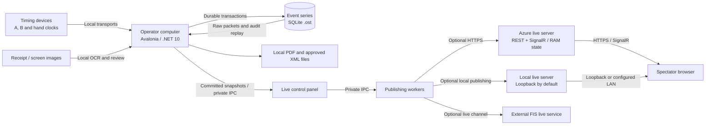
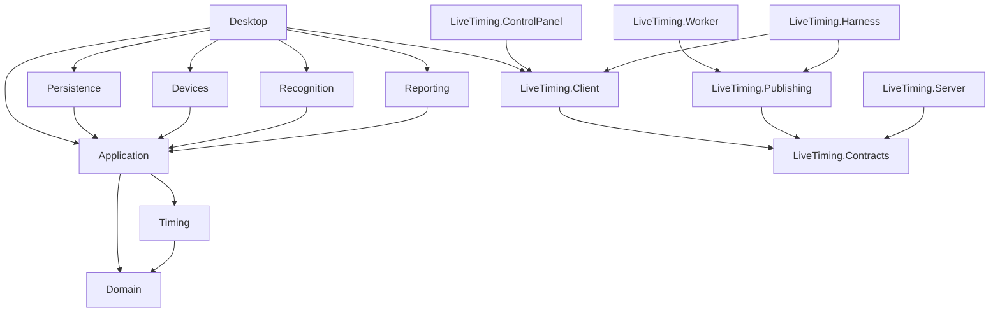
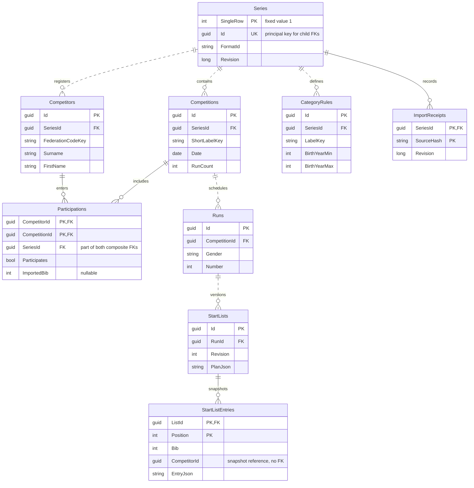
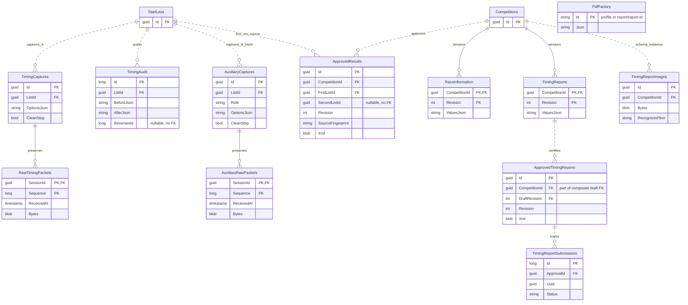
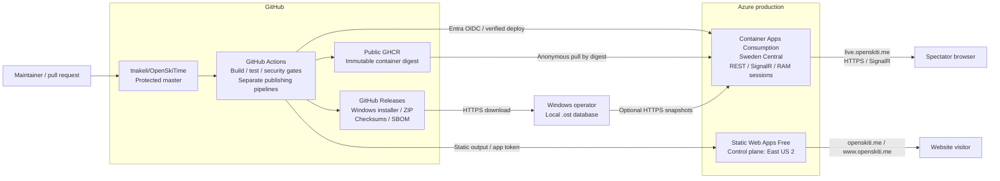

# OpenSkiTime architecture

This document describes the implemented software, local database and Azure/GitHub architecture reviewed on 2026-10-03. The repository uses **GitHub and GitHub Actions**; no GitLab pipeline is configured. All diagrams are embedded Mermaid diagrams, keeping the descriptions and diagrams in one file.

## 1. System overview

OpenSkiTime is a Windows-first Avalonia desktop application targeting .NET 10 LTS. Registration, start lists, timing, corrections, results, receipt recognition and PDF generation run locally. Each event series has a portable SQLite `.ost` database. Race operation works offline; network-connected timing devices still require their local transport.

The operator computer owns the authoritative race data. Optional live publishing sends committed race state to an independent server for browser spectators. Azure hosts the public website and optional live server; it does not host the operator database or perform authoritative timing calculations.

This is runtime data flow, not project references. The managed local server defaults to loopback access. Venue viewing requires an independently configured server with a LAN listener/public origin; publishing to another machine requires HTTPS. Both use the same server application without a cloud dependency. Public live results are unofficial views, not approved output. FIS timing-report XML submission is a separate report workflow from the live worker's FIS channel.

## 2. Software structure

### Project responsibilities

All project names below have the `OpenSkiTime.` prefix. Source is under `src/`; tests are under `tests/`.

| Project | Responsibility and boundary |
|---|---|
| `Domain` | Race models, validation and draw rules. No infrastructure dependencies. |
| `Timing` | Deterministic timing replay, associations, classification, backup comparisons and results. Depends on Domain; no UI, database, network or device I/O. |
| `Application` | Use cases, series/capture workspaces, import preview/application and typed storage/device/report contracts. Depends on Domain and Timing. |
| `Persistence` | EF Core/SQLite adapters; transactions, format checks, raw history, revisions and backup. |
| `Devices` | Transport adapters and protocol decoding behind application contracts. |
| `TimyUsbHost` | Separate Windows .NET Framework 4.8 process isolating the vendor USB interface. Vendor drivers/SDK are separate prerequisites. |
| `Recognition` | Local Tesseract receipt/screen OCR behind application contracts. |
| `Reporting` | QuestPDF rendering from application snapshots. |
| `Desktop` | Avalonia operator UI, composition of adapters, navigation and local preferences. |
| `LiveTiming.Contracts` | Shared typed IPC, publishing and viewer models. |
| `LiveTiming.Client` | Private process/IPC clients and Windows Credential Manager integration. |
| `LiveTiming.ControlPanel` | Separate Avalonia UI for channels, worker lifecycle and publishing status. |
| `LiveTiming.Publishing` | Publishing logic/adapters, independent of the operator database. |
| `LiveTiming.Worker` | Separate process hosting publishing work. |
| `LiveTiming.Server` | ASP.NET Core REST/SignalR server, browser assets and bounded in-memory sessions. Runs locally or in a container. |
| `LiveTiming.Harness` | Synthetic live integration/acceptance tooling. |

Arrows show compile-time project dependencies. Build-only references with `ReferenceOutputAssembly="false"` additionally package companion executables: Desktop includes the live panel/worker/server, the panel includes worker/server, and Devices includes TimyUsbHost. These are process boundaries rather than executable assembly references. `LiveTimingArtifacts.targets` copies companion output into desktop build/publish output.

`OpenSkiTime.slnx` builds the full application and tests; `OpenSkiTime.LiveTiming.slnx` builds the live subset. Windows-specific USB and credential integration is isolated from portable domain/timing code. This supports a path toward Linux without implying that every desktop/device feature already works there.

### Capture, calculations and concurrency

1. Transports supply original input to a bounded asynchronous capture queue, separating reception from storage/calculation.
2. The capture writer assigns a session-local sequence and persists original bytes, receive time and protocol/source/stream identity. The saved-packet counter advances only after the durable write succeeds.
3. Persisted input is decoded and replayed with saved decisions. Malformed and duplicate input remains in raw history even when it cannot produce a usable observation.
4. Corrections append operator, reason, time, before/after decisions and source references. Optimistic timing-version checks reject stale changes; correction batches commit together. Undo appends a reversal rather than deleting history.
5. UI, reports and publishing consume the resulting state. Rendering, OCR and outbound publishing are outside the durable capture writer's responsibility.

Authoritative timestamp arithmetic uses signed integer ticks on one **100 ns scale**, preserving source precision separately. Padding lower-resolution clocks does not invent accuracy. Each run's net time is calculated before truncation to integer hundredths; combined results sum the per-run hundredths. Backup replacement/EET has its own reviewed rounding rules. Dates, rules and clock interpretation are explicit calculation inputs. Reviewed editions and rule references are in [FIS timing review](fis-timing-review.md).

Primary A capture and auxiliary B/hand capture use separate sessions and raw tables. Auxiliary evidence does not silently overwrite A timing; replacements require reviewed, audited decisions. Receipt images, OCR text and proposals remain in dialog memory. Acceptance saves report values/history; closing discards images and unaccepted proposals.

The series workspace serializes coordinated use cases; persistence uses short-lived contexts and explicit transactions. A capture ownership lease prevents conflicting registration/competition changes and closing a file before capture drains. Interrupted capture is resolved through recovery/replay, not database reset. Live processes use private, current-user named pipes. The control panel owns a worker per started channel; the local worker owns its server process. Closing the panel stops its publishing process tree while authoritative capture continues.

### Report boundaries

Start lists and approved exports use saved revisions and source fingerprints. Approval validates the reviewed source against current data before storing immutable XML/approval metadata. Timing-report submissions preserve the FIS UUID/status for checking after reopening; transport acceptance and final FIS processing are separate states.

PDF Factory renders locally and stores source-version/hash metadata in the series. PDFs are external output files; Open opens the generated file. General PDF settings can embed a template in the series. The FIS referee report uses its own fixed margins, official layout and expanding status tables, independent of organizer header/footer/template settings. See [PDF Factory](pdf-factory.md).

## 3. Local database

### Ownership, format and durability

| Property | Implemented behavior |
|---|---|
| Engine | SQLite via EF Core; one `.ost` file per series. No central race database. |
| Development format | `OpenSkiTime.Development/4`, stored in the single Series row. |
| Creation/opening | Create the current model in a temporary sibling file, then move into place. Open checks format and SQLite integrity before accepting the session. |
| Compatibility | Reject incompatible development files unchanged; no migrations or automatic schema upgrades during pre-release development. |
| Connections | Short-lived contexts; WAL journal, `synchronous=FULL`, foreign keys enabled, pooling disabled, five-second SQLite timeout. |
| Concurrency | Optimistic series revision; timing-version and approval source/revision checks. |
| History | SQLite triggers reject UPDATE/DELETE on raw, audit and report/approval history tables listed below. |
| Backup | SQLite online backup includes committed WAL data, writes a temporary destination, normalizes its journal and verifies it before publishing the backup file. |
| Transfer | Use verified backup or a safely closed series. Copying only `.ost` during WAL writes can omit data. Preferences/credentials are not required to read race history. |

There are 20 base application tables. Optional `PdfFactory` is created transactionally on an explicit profile/report save; reading settings does not add it. SQLite internal tables are excluded from the ER model.

### ER diagram

Two connected views show the same physical model for readability. **Competitions** and **StartLists** appear in both. Crow's feet denote zero-to-many children, each with one required parent. Lines represent declared foreign keys. `PK` is a primary-key component, `FK` a foreign-key component and `UK` a unique identifier. Selected fields show keys and major payloads; the table descriptions provide additional context. Diagram types express application types: SQLite stores GUIDs, dates, timestamp metadata, decimals and JSON as TEXT, counters/flags as INTEGER and original bytes/XML as BLOB.

Registration and start lists:

Timing, approvals and reporting:

`Participations` uses composite FKs `(SeriesId, CompetitorId)` and `(SeriesId, CompetitionId)` to the corresponding `(SeriesId, Id)` alternate keys, preventing cross-series participation. `ApprovedTimingReports` references the exact draft through `(CompetitionId, DraftRevision)` → `TimingReports(CompetitionId, Revision)`.

`StartListEntries.CompetitorId` has no FK to the current registration row: an entry preserves a saved athlete snapshot. `ApprovedResults.SecondListId` and `TimingAudit.ReversesId` are logical references checked by application behavior without declared SQLite FKs. Standalone `PdfFactory` has no FK. These distinctions matter when querying/extending the schema.

### Table descriptions

| Table | Key and purpose |
|---|---|
| `Series` | PK `SingleRow=1`; unique `Id`. Name, location, organizer, date range, nation, season, format and revision. Child FKs target `Id`, not `SingleRow`. |
| `Competitions` | PK `Id`; series FK. Race name/label/date, discipline, Club/FIS type, run/intermediate counts, codex, course/homologation data and optional calendar JSON. |
| `Competitors` | PK `Id`; series FK. Normalized identity, optional federation code, birth year, nation, club and gender. |
| `Participations` | PK `(CompetitorId, CompetitionId)`; composite FKs enforce common series ownership. Participation flag and optional imported bib/start order. |
| `CategoryRules` | PK `Id`; series FK. Label, birth-year range, optional gender and display order. |
| `ImportReceipts` | PK `(SeriesId, SourceHash)`; series FK. Import identity, applied revision and created/updated counts. |
| `Runs` | PK `Id`; competition FK. Gender/run number; unique `(CompetitionId, Gender, Number)`. |
| `StartLists` | PK `Id`; run FK. Unique `(RunId, Revision)`, creation/approval/start metadata, operator/reason, source timing version and plan JSON. |
| `StartListEntries` | PK `(ListId, Position)`; list FK. Bib and athlete snapshot JSON; unique bib and competitor ID within a list. |
| `TimingCaptures` | PK `Id`; list FK. Primary capture options and start/stop/clean-stop metadata. |
| `RawTimingPackets` | PK `(SessionId, Sequence)`; primary capture FK. Original bytes, receive time and protocol/source/stream identity. Append-only. |
| `TimingAudit` | Generated integer PK `Id`; list FK. Operator/reason/time, before/after decision JSON with source references and optional reversal ID. Append-only. |
| `AuxiliaryCaptures` | PK `Id`; list FK. Separate B/HandStart/HandFinish role, live flag, options and lifecycle metadata. |
| `AuxiliaryRawPackets` | PK `(SessionId, Sequence)`; auxiliary capture FK. Original backup/hand input, receive time and source identity. Append-only. |
| `RaceInformation` | PK `(CompetitionId, Revision)`; competition FK. Race-information JSON and save time. Append-only revisions. |
| `ApprovedResults` | PK `Id`; competition/first-list FKs. Unique competition revision, optional second list, source fingerprint, approver/time, exact XML bytes/name, decimal calculated/applied penalty and optional information JSON. Append-only. |
| `TimingReports` | PK `(CompetitionId, Revision)`; competition FK. Draft JSON, save time, operator and reason. Append-only revisions. |
| `TimingReportImages` | PK `Id`; competition FK. Schema supports image bytes, OCR text/engine and run/role/source metadata. Existing evidence can be read/validated; the current receipt dialog does **not** persist images/OCR text here. Append-only if populated. |
| `ApprovedTimingReports` | PK `Id`; composite FK to reviewed draft. Unique `(CompetitionId, Revision)`, source fingerprint, approver/time and exact approved XML bytes/name. Append-only. |
| `TimingReportSubmissions` | Generated integer PK `Id`; approval FK. Submission UUID, status, response and time. Status records append rather than rewrite history. |
| `PdfFactory` | Optional PK `Id`, payload `Json`. `profile` stores settings/template; `report/` rows store generated-file metadata, source version and hash. Mutable settings/receipts, not race audit history. |

### Constraints and stored snapshots

Normalized competition short labels and category labels are unique within a series. Non-null federation code keys uniquely identify competitors within a series. Imported bibs are unique within a competition when present. Database checks constrain runs to 1–9, intermediates to 0–20, bibs to 1–99999, raw sequence numbers to positive values and category year ranges to valid order. Application validation covers additional semantics before mutation.

Registration children use cascading FKs; run, list, capture and report relationships use restrictive deletion. Raw primary/auxiliary packets, TimingAudit, RaceInformation, ApprovedResults, TimingReports, TimingReportImages, ApprovedTimingReports and TimingReportSubmissions also have triggers rejecting updates/deletes. History is extended with new decisions/revisions.

Relational columns support identity, ownership, ordering and constraints. JSON preserves typed snapshots: list plans/entries, capture options, before/after decisions, race information and drafts. Snapshots retain reviewed context instead of reconstructing old output from today's registration. Approved XML is a BLOB for exact re-export. Timing results are rebuilt from packets/audit decisions; there is no mutable authoritative per-competitor net-time table.

### Data outside the series

Preferences, recent-file history, local category presets and downloaded FIS caches are separate local files, generally under `%LOCALAPPDATA%/OpenSkiTime`. Relevant athlete/rule context is captured in race/start-list snapshots. Publishing credentials use Windows Credential Manager and are not portable series content. Original receipts are retained separately by the operator when needed; generated PDFs are separate artifacts. Credentials, downloaded FIS lists and personal race data do not belong in Git or committed fixtures.

## 4. Azure and GitHub architecture

### High-level diagram

The diagram summarizes delivery and trust boundaries. Cloudflare provides DNS-only records; Azure manages HTTPS certificates. The live signing key is a Container App secret. Individual publishing pipelines have their own triggers and repeat required validation. Ordinary master CI success does not automatically publish a Windows release or deploy the live server.

### Services and ownership

| Component | Current implementation |
|---|---|
| Source/CI | Public GitHub repository; protected master and required checks/review rules. Windows/Linux Actions jobs; no GitLab or Azure DevOps pipeline. |
| Website | Dependency-free static website built from `website/`, guide and preview assets. Azure Static Web Apps Free serves apex/www; no Functions backend. |
| Live hosting | Container Apps Consumption in Sweden Central. One active revision, 0.5 CPU / 1 GiB, default minimum zero and maximum one replica. Minimum one can be used during a race window. |
| Live state | Bounded server RAM. No Azure SQL, Cosmos DB, Redis, Azure SignalR Service or persistent cloud race archive. ASP.NET Core hosts SignalR itself. |
| Registry | Public `ghcr.io/tnakeli/openskitime-live`; deploy by immutable SHA-256 digest. Anonymous pull; no Azure Container Registry dependency. |
| DNS/TLS | Cloudflare DNS-only records and Azure-managed HTTPS certificates; Cloudflare is not a reverse proxy here. |
| Observability | `/health` probes and synthetic deployment checks. No configured Log Analytics destination; cloud logging is not a durable race audit trail. |
| Infrastructure | Bicep/PowerShell under `deploy/azure/` and `deploy/live-timing/`. Bootstrap resource/identity/domain setup is separate from routine app deployment. |

Deployed Static Web Apps control-plane region is **East US 2**. The Bicep website parameter defaults to West Europe; provisioning used an explicit East US 2 override. Live hosting remains Sweden Central. Static content delivery is distributed independently of the control-plane region.

### Publication paths

| Path | Trigger, gates and output |
|---|---|
| PR/master CI | `ci.yml`: application build/tests, website checks, infrastructure validation and scans of the Windows package/live container. Pull requests that change only `website/`, `docs/`, top-level Markdown or the website workflow skip the Windows build/tests and both scans; skipped jobs satisfy the required checks. Master pushes and weekly/manual runs always run everything. No production deployment credentials. |
| Website | `website.yml`: enabled master changes matching website/assets/workflow paths, stable release updates or explicit run. Build/check site and published stable release metadata, then upload static output. |
| Windows release | `windows-release.yml`: `v*` tags. Validate source ancestry, build/test, package self-contained x64 ZIP/Inno installer, verify installation/reinstallation/uninstallation and scan before publishing Release assets. Prereleases do not replace stable website downloads. |
| Live server | `live.yml`: `live-v*` tags or manual deployment. Build/test, push GHCR and scan the same immutable digest before enabled deployment. Verify custom HTTPS health/acceptance; failed verification attempts rollback to the prior image. |

Windows packages include the .NET runtime and live companion processes. Timy USB retains Windows/.NET Framework/vendor-driver prerequisites. Releases are currently unsigned.

Actions are pinned to source SHAs. NuGet restore audits dependencies; Trivy produces SBOM/CVE/provenance reports. Scanner failures and high/critical findings block checks/publication. Releases include checksums and reports. These checks cover detected dependencies, not proof of advisory coverage for every native component or vendor driver.

### Authentication and failure boundaries

Live deployment uses GitHub OIDC federation to Entra ID, bound to this repository's `production-live` environment. Its service principal has Contributor on the one Container App and Reader on its managed environment, not subscription-wide deployment authority. Website upload uses an app-scoped token in `production-website`. Release publishing grants repository write access only to its publishing job. Cloudflare setup credentials stay in the local bootstrap shell, not GitHub.

The signing key is a Container App secret, kept stable across ordinary restarts. Publisher credentials and public read-only viewer access are separate; spectators cannot issue timing corrections. Publishing may expose selected athlete/result data, so operators choose what to publish.

Cloud/network failure does not stop local capture, correction, reporting or backup. Publishing status is independent. Scale-to-zero, restart or deployment can discard RAM state; an active publisher restores its full snapshot. There is no cloud recovery copy of `.ost`. Update and rollback can both reset live state, so deployments need to account for the race window.

## 5. Verification and source map

The document is grounded in project references, persistence mappings and deployment definitions. It introduces no runtime schema or cloud configuration changes.

| Concern | Primary repository sources |
|---|---|
| Projects/packaging | `src/*/*.csproj`, [full solution](../OpenSkiTime.slnx), [live solution](../OpenSkiTime.LiveTiming.slnx), [companion artifacts](../LiveTimingArtifacts.targets) |
| Application/capture | [series workspace](../src/OpenSkiTime.Application/SeriesWorkspace.cs), [primary capture](../src/OpenSkiTime.Application/TimingCapture.cs), [auxiliary capture](../src/OpenSkiTime.Application/AuxiliaryTimingCapture.cs) |
| Relational model | [SeriesDbContext](../src/OpenSkiTime.Persistence/SeriesDbContext.cs), [timing schema](../src/OpenSkiTime.Persistence/TimingSchema.cs), [auxiliary schema](../src/OpenSkiTime.Persistence/AuxiliaryTimingSchema.cs), [report schema](../src/OpenSkiTime.Persistence/TimingReportSchema.cs) |
| Storage/history | [series-file store](../src/OpenSkiTime.Persistence/SqliteSeriesFileStore.cs), [timing store](../src/OpenSkiTime.Persistence/TimingStore.cs), [results](../src/OpenSkiTime.Persistence/ResultStore.cs), [timing reports](../src/OpenSkiTime.Persistence/TimingReportStore.cs), [PDF settings](../src/OpenSkiTime.Persistence/PdfFactoryStore.cs) |
| Live runtime | [sessions](../src/OpenSkiTime.LiveTiming.Server/SessionStore.cs), [worker](../src/OpenSkiTime.LiveTiming.Worker/Program.cs), [credentials](../src/OpenSkiTime.LiveTiming.Client/WindowsCredentialStore.cs) |
| Azure | [infrastructure](../deploy/azure/main.bicep), [Container App](../deploy/live-timing/containerapp.bicep), [operations/deployed topology](website-and-releases.md) |
| Publication | [CI](../.github/workflows/ci.yml), [website](../.github/workflows/website.yml), [Windows release](../.github/workflows/windows-release.yml), [live release](../.github/workflows/live.yml), [supply chain](software-supply-chain.md) |
| Policies/operation | [database policy](development-database-policy.md), [FIS review](fis-timing-review.md), [timing](timing.md), [timing report](timing-report.md), [PDF Factory](pdf-factory.md) |

Tests are divided between `OpenSkiTime.Tests` (domain/application/persistence/timing/devices/recognition/reporting), `OpenSkiTime.Desktop.Tests` (desktop behavior) and `OpenSkiTime.LiveTiming.Tests` (live/process boundaries). They cover synthetic raw replay, failure paths, audit/undo, backup/reopen, immutable approvals, PDF generation and publishing isolation. Physical devices, race-day load and real FIS acceptance need separate operational verification; software tests do not establish those external conditions.
