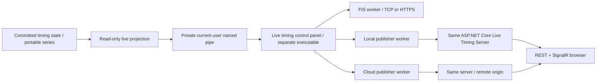

# Live timing

OpenSkiTime supplies three independent downstream channels: FIS Live Timing, Standalone Local and Standalone Cloud. Local and Cloud run exactly the same .NET 10 ASP.NET Core server. Cloud is tested locally in this development phase; Azure resources and DNS have not been deployed.

## Operator workflow

Open a saved timing run. The timing connection row shows compact **Local**, **Cloud** and **FIS** indicators: green means Running, red means Starting, Reconnecting or Error, and pale means Stopped. Hover an indicator for the full state, endpoint, last successful publish, error and expiry. **Live timing…** launches `OpenSkiTime.LiveTiming.ControlPanel.exe` in its own window without taking focus from timing. Pressing the button again restores and activates the existing panel. All channels may run together; FIS requires an alpine FIS competition with a numeric codex, password and complete racer FIS codes/nations.

The control panel uses the OpenSkiTime navy and teal palette with separate publishing-channel cards and connection-settings cards. Both columns scroll vertically in smaller windows. Sharing and deletion controls appear when a standalone session has a public URL. Settings apply on Start; Refresh also requests a fresh race snapshot with the chosen time zone.

Closing the panel stops its publishers and local server. Ending only `OpenSkiTime.LiveTiming.ControlPanel.exe` in Windows Task Manager also stops the whole live timing process tree. Authoritative timing capture continues in OpenSkiTime. Reopen the panel and press Start to resume. Cloud can reuse its retained valid session; a new panel has a new Local server and creates a new Local URL. A forced exit does not send a public pause message. Use Stop when the public session should explicitly show Paused. The executable can also be opened directly, but it needs the timing application's button to establish a race connection.

Set the race's time zone (Windows or IANA ID, e.g. `Europe/Helsinki`), endpoints and FIS transport/password. Defaults are local `http://localhost:5078`, FIS TCP `live.fis-ski.com:1550` and HTTPS `https://livedata.fis-ski.com/al/`. The cloud default `https://live.openskiti.me` is a future deployment address; replace it with a local cloud simulation URL now.

| Control | Behavior |
|---|---|
| Start | Starts/restarts the channel worker. Local additionally starts its server process. Creates a session if needed, sends a full snapshot and then publishes changes. A valid cloud credential preserves the URL. |
| Stop | Stops publishing; standalone keeps the last state publicly visible with a paused banner. Server/session and credential remain available for resume. FIS sends no more updates/keepalives. |
| Refresh | Resumes the worker and replaces server state with the latest authoritative snapshot; no dependency on queued historical events. |
| Delete session | Stops publishing and removes the session's state. The old URL displays unavailable. Start creates a new URL. |
| Delete All Data | Explicit data-removal action: identical full-session removal in this RAM-only server, including all competitors, lists, results, intermediates and state. It is separate from Stop. |
| Copy URL / Open URL | Shares or opens the public standalone view. Credential is never in the public URL. |

Changing competitions stops the publishers for the previous competition. Changing runs within the same competition retains prior runs and publishes the new current run. Edit endpoint/transport settings and press Start to replace that channel's process. A failed delete is reported as an error and stops further publishing; reconnect to the endpoint and retry deletion. A successful delete is shown only after its HTTP response.

The browser shows competition/place/discipline/run, competitors, bib/name/nation/club, statuses, intermediates, finish/rank/difference, racers on course and the last live update. It subscribes to SignalR over WebSocket and reconnects without a page reload: a closed socket, a SignalR close message or 35 seconds without any server message (the server pings every 15 seconds, so this catches half-open connections left by a replaced revision) starts a new connection after a jittered exponential backoff of 0.5–15 seconds, and a returning network reconnects at once. The viewer sends SignalR pings every 15 seconds. Every (re)subscription receives the complete current state. If a restarted server has no state yet, the viewer keeps the last results visible as **Waiting for publisher · Last state retained** until the publisher restores them; an explicit deletion broadcast still clears the page. HTML/CSS/JavaScript are served locally, with no CDN or Internet dependency. These are provisional run results; official result approval/publication remains a separate workflow.

## Process and timing boundary



Domain, timing, device capture and SQLite schemas do not acquire live timing dependencies. The desktop polls immutable, already committed timing snapshots. It offers one latest-state reference to the control panel; serialization/IPC/network work happens asynchronously. The panel has no series-database or timing-device access. Start and Refresh request a fresh read-only projection from the desktop before publishing, including time-zone validation. Older projection versions cannot overwrite newer panel state. There are no synchronous network calls on capture threads or unbounded replay queues.

The panel owns one independent publisher process per started channel. Private unpredictable named pipes with `CurrentUserOnly` carry typed JSON control/state envelopes and health/credential replies. Secrets are delivered through pipes, never process arguments. The local server is a child of the local worker. Stop preserves it; disposing a publisher kills its owned process tree. On Windows the panel and all descendants belong to a kill-on-close Job Object owned by the desktop; panel disconnection closes the job, including descendants orphaned by a forced exit. Desktop exit also closes the job. Linux uses pipe-disconnection cleanup and explicit process-tree termination; Windows Job Object semantics are isolated in the client library and Linux forced-exit cleanup has not been verified. A worker crash is shown as Error; Start replaces the failed generation and sends the latest snapshot. Local server crashes are automatically restarted with the same process-lifetime signing key and restored state. A cloud server restart uses its unchanged configured signing key.

The latest snapshot is bounded by the contract (2,000 competitors, nine runs, twenty intermediates) and server payload limit; control queues have sixteen slots. Broken IPC, invalid clock projection and process-start failures are caught at the optional integration boundary and reported separately. Network timeout/retry cannot interrupt device capture or durable raw input commits. This does not reserve OS CPU/RAM against arbitrary system-wide resource exhaustion.

## Snapshot/event protocol

`OpenSkiTime.LiveTiming.Contracts` defines explicit typed snapshots, runs, results, events, sessions, health and IPC contracts. Source timestamps retain the full date-bearing integer .NET tick value (100 ns); JSON writes source ticks as decimal strings to avoid JavaScript precision loss. Timing computes elapsed hundredths; publishers do not recalculate raw impulse differences. Device clocks already supply dates/rollovers; local device timestamps use the explicitly selected race zone, while ALGE Results UTC timestamps stay UTC. Ambiguous/invalid DST times block live projection for review.

| API | Access / meaning |
|---|---|
| `GET /health` | Public process health (Running, process ID and supported live protocol). No race data or secrets. |
| `GET /api/sessions` | Public list of active sessions with published state (ID, name, place, discipline, date, gender, category, codex, update time, paused). No credentials. |
| `POST /api/sessions` | Requires `Authorization: Bearer <publisher key>` issued by the server operator; anonymous or unknown keys get 401. Rate-limited; returns session ID, session-scoped publisher token, expiry and public URL. |
| `GET /api/sessions/{id}/state` | Public snapshot; missing/unpublished/expired/deleted state returns 404. |
| `PUT /api/sessions/{id}/state` | Bearer credential required. Validates the complete snapshot before replacement. Restores a missing RAM session after restart. |
| `POST /api/sessions/{id}/events` | Credential required. Replaces one result row with start/intermediate/finish/status/correction data. Version must be exactly current + 1; gap/replay returns 409 and triggers full resync. |
| `POST /api/sessions/{id}/pause` | Credential required; retains state with paused flag. |
| `DELETE /api/sessions/{id}` | Credential required; removes the entire session and rejects subsequent publishing to its ID. |
| `DELETE /api/sessions/{id}/data` | Credential required; explicit Delete All Data alias with the same complete removal behavior. |
| `/live` and `/live/negotiate` | SignalR JSON protocol. `Watch(sessionId)` subscribes to one public session per connection; `State` pushes the latest snapshot or null after deletion. |
| `/r/{id}` | Responsive public view. No credential in the path or query. |
| `/` | Lists all active published races with links to their `/r/{id}` views. |
| `/.well-known/security.txt` | RFC 9116 security contact. |

Every response carries the server's live protocol version in `X-OpenSkiTime-Live-Protocol`. The publisher sends its `LiveProtocol.Version` in the same header on every request. A request declaring a different version is refused with HTTP 426 before routing or mutation; the worker reports an incompatible server and stops rather than retrying. Requests without the header, such as browsers and diagnostic tools, are treated as the current version. Application and server release versions are independent; see [release process](release-process.md#versioning).

Normally the publisher compares latest snapshots and sends changed result rows as events, including changed rankings/corrections. Competitor/order/metadata/run topology changes use a snapshot. Multiple changes are sent with contiguous wire revisions. IPC may coalesce intermediate snapshots; it cannot lose final authoritative state. A failed partial publish, version conflict, health 404 or restart triggers replacement with the latest full snapshot. A health 404 for an existing session means the server lost its RAM state (restart, new revision or scale-to-zero) while the stateless session token remains valid; the worker republishes every run on its next pass without entering Reconnecting or error backoff. There is one writer per session; multiple competing authoritative publishers are not supported.

Standalone requests time out after five seconds. Failure retries use bounded delays of 1, 2, 4, 8, 16 and 30 seconds, capped at 30. Health is checked every five seconds. Authentication/configuration rejection is Error; network/timeout failures are Reconnecting. Last-connected/last-publish/event times, endpoint, expiry and error are available to desktop health.

## Credentials, expiry and deletion

Session IDs use cryptographic GUID generation. Tokens contain only the session ID and expiry and are authenticated with HMAC-SHA256 using a configured, random, at-least-32-byte signing key. The signature is compared in constant time. Default validity is fourteen days, with a hard maximum of fourteen days; session lifetime is the same. Keys are not embedded in OpenSkiTime. A token can manage only its own session. The server has no credential database or race database.

Windows desktop retains cloud credentials in Windows Credential Manager, scoped by competition ID and a hash of the endpoint. Local credentials/signing keys stay in process memory. Worker restart preserves these through private IPC; application restart can reuse a saved cloud credential and reconstruct all race state from the series. FIS passwords stay in memory and are entered by the operator. Linux live-server/publisher support is isolated; persistent desktop credential storage currently requires Windows.

Deletion wipes the cached snapshot and all race content immediately. A bounded RAM revocation marker retains only opaque session ID and expiry to prevent the old credential recreating it during that server lifetime. No race/event history/cache survives deletion, and desktop removes its retained token. **Stateless credentials and RAM revocations mean an independently retained old token could restore a deleted ID after a whole server restart, until token expiry.** Rotate the signing key to invalidate every outstanding credential if compromised; persistent per-token revocation would require an additional durable revocation store and is not part of this RAM-only first version. Normal desktop never reuses a successfully deleted credential.

Session creation requires an operator-issued publisher key (stored only as a SHA-256 hash on the server; see [publisher keys](live-timing-cloud-deployment.md#publisher-keys)) and has a per-client fixed-window limit (five/minute). Every client also has its own request budget and concurrent viewer-connection limit, so one source cannot exhaust the service for others. Session/revocation capacity, payload and connection limits, no queued rate-limited requests and a fourteen-day maximum lifetime still apply. Session expiry is pruned during requests. Deleted-ID markers consume capacity until expiry; adjust capacity for the expected event calendar.

The viewer's front page lists every active published race. Viewer pages hide the intermediates column while the selected run has no intermediate times, and link to the [privacy statement](https://openskiti.me/privacy/) and the server's `security.txt`.

## FIS TCP and HTTPS

Reviewed supplied primary documents:

- **Live XML documentation for AL MA PAL CC JP NK (v53)**: structure/initialization pp. 8–9; source/send timestamp hierarchy pp. 10–12; raceinfo/racedef pp. 13–18, alpine discipline/run semantics p. 23; active command pp. 28–31; startlist pp. 39–42; alpine events pp. 50–57; corrections/examples pp. 69–71; keepalive/acknowledgements p. 75. The cover says v53 while its changelog also includes a v54 entry; the supplied document is the reviewed edition.
- **Sending FIS live result data over HTTPS v1.6, 02.10.2025**: hosts/paths pp. 3–4; raw UTF-8 POST with `text/plain` p. 4; HTTP 200 plus matching XML sequence or HTTP 400 error p. 5.

TCP sends UTF-8 XML documents on a persistent socket to the configured host/port. It supports fragmented acknowledgement frames and bounded response buffering. HTTPS posts the same XML to the configured TLS endpoint; normal certificate validation applies and redirects are disabled. There is no separate login exchange: every `livetiming` header contains codex, password, monotonically increasing sequence and send timestamp. An acknowledgement must match that sequence.

Initialization is raceinfo → run startlist → active run → replayed run state. FIS startlist **clears that run's results** (v53 p. 41), so full recovery restores every known run in ascending order, then reactivates the current run. Regular timing updates do not resend startlists. DNS→`dns`, DNF→`dnf`, DSQ→`dq`, NPS→`nps`; start, inter, finish, time/difference/rank and corrections use the documented elements. Finish transmits this run's net time; FIS accumulates prior run times (p. 23). Corrections use `correction="y"`; resets/removal rebuild the run so old status/split values cannot remain. XML escaping is automatic.

Event timestamps retain actual source date/time/offset even during resend; parent send timestamps reflect transmission time. Keepalive runs after five minutes of inactivity, in the recommended five–ten-minute interval. FIS socket operations/acknowledgements time out after eight seconds. No `clear`, cancellation or official-result command is sent automatically. Live timing is not official result submission.

Worker debug logs are under `%LOCALAPPDATA%/OpenSkiTime/LiveTimingLogs`, rotated at 4 MiB per process plus one previous file. They record lifecycle, retry/health, HTTP statuses, snapshot/event operations and redacted FIS wire XML. Password attributes and echoed passwords are redacted; signing keys and publisher tokens are never logged. FIS wire logs can contain racer identities because protocol reconstruction is explicitly required; retain them only locally, restrict access and delete them after troubleshooting. They are never committed or added to the series database.

## Build, simulation and tests

An earlier-run correction during a later run triggers a full FIS replay of all runs. This restores subsequent cumulative differences/ranks even when their individual run times have not changed. The TCP E2E exercises a first-run correction that changes the second-run overall leader, verifying the final individual run time, total difference and rank on the wire.

Install .NET 10 SDK (or compatible .NET 10 + ASP.NET Core runtimes for a framework-dependent desktop distribution). Desktop build/publish copies worker/server artifacts and local web assets under `LiveTiming/Worker` and `LiveTiming/Server`.

```powershell
dotnet build OpenSkiTime.slnx
dotnet test OpenSkiTime.slnx
dotnet build OpenSkiTime.LiveTiming.slnx
```

Local cloud simulation, in a separate terminal:

```powershell
$env:LiveTiming__SigningKey = [Convert]::ToBase64String([Security.Cryptography.RandomNumberGenerator]::GetBytes(32))
$env:LiveTiming__PublicBaseUrl = 'http://localhost:5080'
$key = 'ost_pk_' + [Convert]::ToHexString([Security.Cryptography.RandomNumberGenerator]::GetBytes(32))
$env:LiveTiming__PublisherKeys = 'local-test:' + [Convert]::ToHexString([Security.Cryptography.SHA256]::HashData([Text.Encoding]::UTF8.GetBytes($key))).ToLowerInvariant()
dotnet run --project src/OpenSkiTime.LiveTiming.Server -- --urls http://localhost:5080
```

Use this as the Cloud URL in desktop and save `$key` in Settings → Live timing. Preserve the signing key when restarting that server. Managed Local uses a separate port and does not depend on this process. For a network-local server, run the same server independently with an explicit signing key/public origin and a LAN bind address; the current publisher permits HTTP only on loopback, so use HTTPS for a publisher on another machine. Public LAN viewers may access an HTTP listener if publishing remains on loopback.

The harness generates fifty synthetic competitors with deterministic starts, two intermediates, finishes, DNS/DNF/DSQ and integer times. For example after building:

```powershell
dotnet src/OpenSkiTime.LiveTiming.Harness/bin/Debug/net10.0/OpenSkiTime.LiveTiming.Harness.dll local `
  src/OpenSkiTime.LiveTiming.Worker/bin/Debug/net10.0/OpenSkiTime.LiveTiming.Worker.dll `
  http://localhost:5078 `
  src/OpenSkiTime.LiveTiming.Server/bin/Debug/net10.0/OpenSkiTime.LiveTiming.Server.dll
```

Use `cloud <absolute-worker.dll> http://localhost:5080` to target an independently started server. Use absolute assembly paths when the current directory is not the repository root. FIS modes are `fis-tcp <host> [count]` and `fis-https <https-url> [count]`, reading `OST_FIS_PASSWORD` and optional `OST_FIS_CODEX` from environment. Never put passwords in command arguments, fixtures or Git. The default synthetic codex is the supplied test race 9754; live FIS tests are manual, not part of CI.

Real Chromium E2E (requires Python + Playwright/Chromium installed outside the repository):

```powershell
python -m pip install playwright
python -m playwright install chromium
python tests/live-timing-browser-e2e.py --dotnet <dotnet-host-path>
```

See [test evidence](live-timing-test-results.md) and [future cloud deployment](live-timing-cloud-deployment.md). Azure deployment, physical timing hardware and a Linux desktop race rehearsal are not acceptance claims for this feature.
